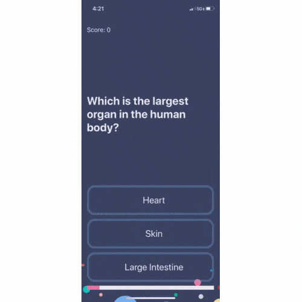

# Quizzler
This app was created as a part of a [Udemy course](https://www.udemy.com/share/101WsWAEMScldUQn8F/) I am taking (April 2020).

The goal was to create a quiz app which could track the user's correct answers.

## Lesson Objectives

* How to programmatically change UI elements such as Labels and Buttons.
* What is a design pattern and how is it used in programming.
* How to use the Model-View-Controller or MVC pattern for app development.
* Learn about Swift Structures how to instantiate a struct instance.
* Understand the difference between value types and reference types. 
* Learn about Swift Classes and creating Objects.
* Compare Swift Classes with Swift Structs and know when to use which.
* Learn about Object Oriented Programming.
* How to refactor code and stay organised.

>This is a companion project to The App Brewery's Complete App Development Bootcamp, check out the full course at [www.appbrewery.co](https://www.appbrewery.co/)

## Final Result

